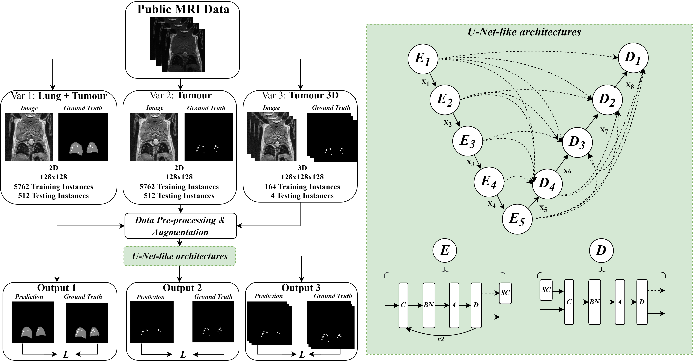
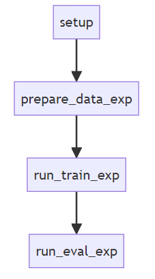

# Lung tumour segmentation using 2D and 3D MR images of mice

This the codebase for *Lung tumour segmentation using 2D and 3D MR images of mice* paper.
___

### Abstract
Accurate lung tumour segmentation is an important step for assessing tumour size and its progression in cancer patients. While deep learning models have been developed to automate this process, the focus has predominantly been on human subjects, neglecting the pivotal role of animal models in preclinical drug development. In our study, we explore various approaches for segmenting lung tumours in MRI scans of mice. Unlike the prior approach that involves the combined segmentation of lungs and tumours within the lungs, our work achieves state-of-the-art results using only lung tumour annotations. Furthermore, we demonstrate that the nnU-Net framework outperforms models such as U-Net, U-Net3+ and DeepMeta. Most importantly, we achieve better results with nnU-Net 3D framework than 2D framework, indicating the importance of spatial context in the field of MRI. This study demonstrates the importance of 3D input over 2D input images for lung tumour segmentation in MRI scans. This work is an important step in automating pre-clinical animal studies to quantify the efficacy of experimental drugs, particularly in assessing tumour changes in animal models.

### Setup
Before running any of the experiments, ensure to set up the virtual environment correctly. 
~~~
conda env create -f environment.yml
conda activate conda_env
~~~
Note that setting up conda might take a long time, alternatively you can use mamba
~~~
mamba create -n conda_env python=3.9
mamba env update -n conda_env --file environment.yml
~~~

### Reproduction

  

If you want to reproduce all experiments, run the following commands 
~~~
python -m src.setup
python -m src.prepare_data
python -m src.run_train
python -m src.run_eval
~~~
These scripts are wrappers which will execute each experiment one-after-one (note that it will take a **long time** to execute all experiments with as many epochs as stated in the publication). For detailed codebase and instructions how to execute a specific expriment only, see [docs](/docs/README.md)
