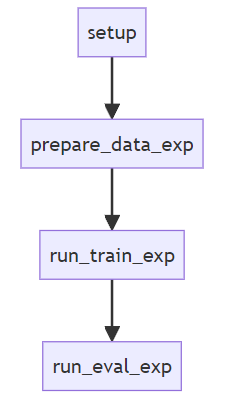
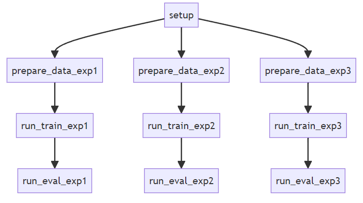

# Documentation
Detailed documentation for reproducing the  "*Lung tumour segmentation using 2D and 3D MR images of mice*" paper. Note that this repository is largely based on two other repositories: [DeepMeta](https://github.com/cbib/DeepMeta "Github DeepMeta repository")  and [nnUNet](https://github.com/MIC-DKFZ/nnUNet "Github nnUNet repository").

## Environment Setup
Before running any of the experiments, ensure to set up the virtual environment correctly (you can use conda or mamba). 
~~~
conda env create -f environment.yml
conda activate conda_env
~~~
As conda might take a while, you can also install it using mamba
~~~
mamba create -n conda_env python=3.9
mamba env update -n conda_env --file environment.yml
~~~
## Reproducing the repository

  

If you want to reproduce all experiments, run the following commands 

~~~
python -m src.setup
python -m src.prepare_data
python -m src.run_train
python -m src.run_eval
~~~

  

However, it is also possible to specify only one experiment that you are interested in:
~~~
# the following will only execute experiment 1, you can change it for 2 or 3
python -m src.setup
python -m src.prepare_data --exp exp1
python -m src.run_train --exp exp1
python -m src.run_eval --exp exp1
~~~

## Repostiory structure
After successful setup and reproduction, the repository structure should look as following
~~~
lung-tumour-mice-mri
├── Lung+Tumour/
│   ├── data
│   │   ├── nnunet_test
│   │   ├── test
│   │   └── train2d
│   ├── nnUNet_preprocessed
│   ├── nnUNet_raw
│   ├── nnUNet_results
│   ├── README.md
│   └── results
│       ├── models
│       ├── outputs
│       └── plots
│
├── Tumour2D/
│   ├── data
│   │   ├── nnunet_test
│   │   ├── test
│   │   └── train2d
│   ├── nnUNet_preprocessed
│   ├── nnUNet_raw
│   ├── nnUNet_results
│   ├── README.md
│   └── results
│       ├── models
│       ├── outputs
│       └── plots
│
├── Tumour3D/
│   ├── data
│   │   ├── nnunet_test
│   │   ├── test
│   │   ├── train2d
│   │   └── train3d
│   ├── nnUNet_preprocessed
│   ├── nnUNet_raw
│   ├── nnUNet_results
│   ├── README.md
│   └── results
│       ├── models
│       ├── outputs
│       └── plots
│
├── data           # original data used to create data variants
│   └── deepmeta_dataset/ 
│
├── docs
│   ├── README.md
│   ├── flowchart_detailed.png
│   ├── flowchart_simple.png
│   └── main_diagram.png
│
├── environment.yml
├── params.yaml
├── README.md
├── requirements.txt
└── src/
    ├── data_variants/      #library for preparing data variants
    │   ├── __init__.py
    │   ├── _2d.py
    │   └── _3d.py
    ├── deepmeta/           #library for deepmeta, unet3p and unet models (adapted from DeepMeta repo)
    │   ├── models/
    │   ├── utils/
    │   ├── __init__.py
    │   ├── train.py
    │   └── predict.py
    ├── nnunet/            #library for nnUNet
    │   ├── nnUNet/
    │   ├── __init__.py    
    │   ├── eval.py
    │   └── utils.py
    ├── __init__.py
    ├── prepare_data.py
    ├── run_eval.py
    ├── run_train.py
    └── setup.py

~~~
## Experiments
The information on how to reproduce a specific experiment can be found in README.md in respective experiment directories.

### Experiment 1: Lung + Tumour Segmentation 
Training the models for the task of segmenting both lung and then lung tumour, exploring the importance of organ background. Codebase can be found in src/nnunet and src/deepmeta.
~~~
python -m src.prepare_data.py --exp exp1
python -m src.run_train.py --exp exp1
python -m src.run_eval.py --exp exp1
~~~

This is the same as:
~~~
python -m src.deepmeta.train --model unet --loss weighted_ce -classes 3 --save_dir Lung+Tumour/results --data_path Lung+Tumour/data --dim 2d --epochs 100 -bs 64 -nworkers 20
python -m src.deepmeta.train --model unet3p --loss unet3p_loss -classes 3 --save_dir Lung+Tumour/results --data_path Lung+Tumour/data --dim 2d --epochs 100 -bs 64 -nworkers 20
python -m src.deepmeta.train --model deepmeta --loss fusion_loss -classes 3 --save_dir Lung+Tumour/results --data_path Lung+Tumour/data --dim 2d --epochs 100 -bs 64 -nworkers 20

python -m src.deepmeta.predict --save --model unet -classes 3 --model_path/Lung+Tumour/results/models/best_unet_model_2d --data_dir Lung+Tumour/data/test --save_dir Lung+Tumour/results/outputs/unet_2d --dim 2d
python -m src.deepmeta.predict --save --model unet3p -classes 3 --model_path/Lung+Tumour/results/models/best_unet3p_model_2d --data_dir Lung+Tumour/data/test --save_dir Lung+Tumour/results/outputs/unet3p_2d --dim 2d
python -m src.deepmeta.predict --save --model deepmeta -classes 3 --model_path/Lung+Tumour/results/models/best_deepmeta_model_2d --data_dir Lung+Tumour/data/test --save_dir Lung+Tumour/results/outputs/deepmeta_2d --dim 2d

export nnUNet_raw='Lung+Tumour/nnUNet_raw'
export nnUNet_preprocessed='Lung+Tumour/nnUNet_preprocessed'
export nnUNet_results='Lung+Tumour/nnUNet_results'

nnUNetv2_plan_and_preprocess -d 1
nnUNetv2_train -d 1 -c 2d 0
nnUNetv2_train -d 1 -c 2d 1
nnUNetv2_train -d 1 -c 2d 2 
nnUNetv2_train -d 1 -c 2d 3 
nnUNetv2_train -d 1 -c 2d 4 

nnUNetv2_predict -d 1 -c 2d -i Lung+Tumour/data/nnunet_test/images -o Lung+Tumour/results/outputs/nnunet_2d 
python -m src.nnunet.eval -classes 3 --gt_path Lung+Tumour/data/nnunet_test/labels --pt_path Lung+Tumour/results/outputs/nnunet_2d
~~~

### Experiment 2: Tumour Segmentation
Training the models for the task of segmenting only lung tumour, exploring the challenge of segmenting sole organ background.

~~~
python -m src.prepare_data.py --exp exp2
python -m src.run_train.py --exp exp2
python -m src.run_eval.py --exp exp2
~~~
This is the same as:
~~~
python -m src.deepmeta.train --model unet --loss weighted_ce -classes 2 --save_dir Tumour2D/results --data_path Tumour2D/data --dim 2d --epochs 100 -bs 64 -nworkers 20
python -m src.deepmeta.train --model unet3p --loss unet3p_loss -classes 2 --save_dir Tumour2D/results --data_path Tumour2D/data --dim 2d --epochs 100 -bs 64 -nworkers 20
python -m src.deepmeta.train --model deepmeta --loss fusion_loss -classes 2 --save_dir Tumour2D/results --data_path Tumour2D/data --dim 2d --epochs 100 -bs 64 -nworkers 20

python -m src.deepmeta.predict --save --model unet -classes 2 --model_path/Tumour2D/results/models/best_unet_model_2d --data_dir Tumour2D/data/test --save_dir Tumour2D/results/outputs/unet_2d --dim 2d
python -m src.deepmeta.predict --save --model unet3p -classes 2 --model_path/Tumour2D/results/models/best_unet3p_model_2d --data_dir Tumour2D/data/test --save_dir Tumour2D/results/outputs/unet3p_2d --dim 2d
python -m src.deepmeta.predict --save --model deepmeta -classes 2 --model_path/Tumour2D/results/models/best_deepmeta_model_2d --data_dir Tumour2D/data/test --save_dir Tumour2D/results/outputs/deepmeta_2d --dim 2d

export nnUNet_raw='Tumour2D/nnUNet_raw'
export nnUNet_preprocessed='Tumour2D/nnUNet_preprocessed'
export nnUNet_results='Tumour2D/nnUNet_results'

nnUNetv2_plan_and_preprocess -d 1
nnUNetv2_train -d 1 -c 2d 0
nnUNetv2_train -d 1 -c 2d 1
nnUNetv2_train -d 1 -c 2d 2 
nnUNetv2_train -d 1 -c 2d 3 
nnUNetv2_train -d 1 -c 2d 4 

nnUNetv2_predict -d 1 -c 2d -i Tumour2D/data/nnunet_test/images -o Tumour2D/results/outputs/nnunet_2d 
python -m src.nnunet.eval -classes 2 --gt_path Tumour2D/data/nnunet_test/labels --pt_path Tumour2D/results/outputs/nnunet_2d
~~~

### Experiment 3: Tumour Segmentation in 3D
Training the models for the task of segmenting only lung tumour using 3D MRI, exploring the challenge of segmenting sole organ background and importance of spatial background. Codebase can be found in src/nnunet. Note that this experiment is very computationally expensive and you might need to adjust memory or number of workers for data loader to be suitable for your system.
~~~
python -m src.prepare_data.py --exp exp3
python -m src.run_train.py --exp exp3
python -m src.run_eval.py --exp exp3
~~~
This is the same as:
~~~
# 2D
python -m src.deepmeta.train --model unet --loss weighted_ce -classes 2 --save_dir Tumour3D/results --data_path Tumour3D/data --dim 2d --epochs 100 -bs 64 -nworkers 64
python -m src.deepmeta.train --model unet3p --loss unet3p_loss -classes 2 --save_dir Tumour3D/results --data_path Tumour3D/data --dim 2d --epochs 100 -bs 64 -nworkers 64
python -m src.deepmeta.train --model deepmeta --loss fusion_loss -classes 2 --save_dir Tumour3D/results --data_path Tumour3D/data --dim 2d --epochs 100 -bs 64 -nworkers 64

python -m src.deepmeta.predict --save --model unet -classes 2 --model_path/Tumour3D/results/models/best_unet_model_2d --data_dir Tumour3D/data/test --save_dir Tumour3D/results/outputs/unet_2d --dim 2d
python -m src.deepmeta.predict --save --model unet3p -classes 2 --model_path/Tumour3D/results/models/best_unet3p_model_2d --data_dir Tumour3D/data/test --save_dir Tumour3D/results/outputs/unet3p_2d --dim 2d
python -m src.deepmeta.predict --save --model deepmeta -classes 2 --model_path/Tumour3D/results/models/best_deepmeta_model_2d --data_dir Tumour3D/data/test --save_dir Tumour3D/results/outputs/deepmeta_2d --dim 2d

export nnUNet_raw='Tumour3D/nnUNet_raw'
export nnUNet_preprocessed='Tumour3D/nnUNet_preprocessed'
export nnUNet_results='Tumour3D/nnUNet_results'

nnUNetv2_plan_and_preprocess -d 1

nnUNetv2_train -d 1 -c 2d 0
nnUNetv2_train -d 1 -c 2d 1
nnUNetv2_train -d 1 -c 2d 2 
nnUNetv2_train -d 1 -c 2d 3 
nnUNetv2_train -d 1 -c 2d 4

nnUNetv2_predict -d 1 -c 2d -i Tumour3D/data/nnunet_test/images -o Tumour3D/results/outputs/nnunet_2d 

python -m src.nnunet.eval -classes 2 --gt_path Tumour3D/data/nnunet_test/labels --pt_path Tumour3D/results/outputs/nnunet_2d --save_path Tumour3D/results/outputs/nnunet_2d

# 3D
python -m src.deepmeta.train --model unet --loss weighted_ce -classes 2 --save_dir Tumour3D/results --data_path Tumour3D/data --dim 3d --epochs 100 -bs 2 -nworkers 64
python -m src.deepmeta.train --model unet3p --loss unet3p_loss -classes 2 --save_dir Tumour3D/results --data_path Tumour3D/data --dim 3d --epochs 100 -bs 2 -nworkers 64
python -m src.deepmeta.train --model deepmeta --loss fusion_loss -classes 2 --save_dir Tumour3D/results --data_path Tumour3D/data --dim 3d --epochs 100 -bs 2 -nworkers 64

nnUNetv2_train -d 1 -c 3d_fullres 0
nnUNetv2_train -d 1 -c 3d_fullres 1
nnUNetv2_train -d 1 -c 3d_fullres 2 
nnUNetv2_train -d 1 -c 3d_fullres 3 
nnUNetv2_train -d 1 -c 3d_fullres 4 

nnUNetv2_predict -d 1 -c 3d_fullres -i Tumour3D/data/nnunet_test/images -o Tumour3D/results/outputs/nnunet_3d

python -m src.nnunet.eval -classes 2 --gt_path Tumour3D/data/nnunet_test/labels --pt_path Tumour3D/results/outputs/nnunet_3d --save_path Tumour3D/results/outputs/nnunet_3d'

~~~

### Custom Experiment
 If you wish to conduct a custom experiment, you might need to not use the wrapper. Use the following structure to run a specific experiment:

~~~
# for experimenting with vanilla unet, unet3plus, deepmeta and different loss functions. Here training unet with fusion loss and dropout 0.2
python -m src.deepmeta.train --model unet --loss fusion --class 2 --dropout 0.2

#for experiment with nnunet, first preprocess specific dataset in nnUNet_raw
nnUNetv2_plan_and_preprocess -d 1

#then you can train the model for 5 folds, for different nnUNet variants or schedulers see nnUNet documentation
nnUNetv2_train -d 3 -c 2d 0
nnUNetv2_train -d 3 -c 2d 1
nnUNetv2_train -d 3 -c 2d 2 
nnUNetv2_train -d 3 -c 2d 3 
nnUNetv2_train -d 3 -c 2d 4 
~~~ 

*Note: nnUNet allows some flexibility, you can change the scheduler, number of epochs, optimizer etc - for details see [Github](https://github.com/MIC-DKFZ/nnUNet "Github repository"). However if you want to change some specific hyperparameters of nnUNet, you might need to modify the nnUNet codebase and re-install the package for changes to take place. You can do that by changing the nnUNet/nnunetv2/training/nnUNetTrainer/nnUNetTrainer.py script, between lines 146 and 155.*

~~~
### Some hyperparameters for you to fiddle with
self.initial_lr = 1e-3
self.weight_decay = 3e-5
self.oversample_foreground_percent = 0.33
self.num_iterations_per_epoch = 250
self.num_val_iterations_per_epoch = 50
self.num_epochs = 1000
self.current_epoch = 0
self.enable_deep_supervision = True
~~~

*Note: these scripts were designed to run once, if you run one script multiple times, you might create great quantities of duplicate data. It might also cause errors: e.g if you run the following twice.* 
~~~
nnUNetv2_plan_and_preprocess -d 1
~~~ 
